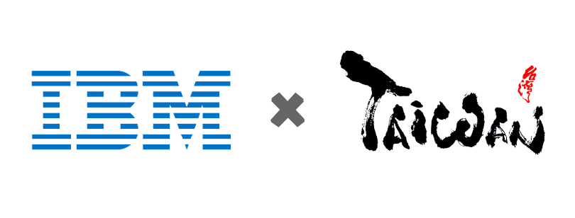

<h1 align='center'>
 

 
 Applied Data Science Capstone
</h1>

  <a href="#updates">Updates</a> • 
  <a href="#course-syllabus">Course Syllabus</a> • 
  <a href="#the-battle-of-neighborhoods">The Battle of Neighborhoods</a> • 
  <a href="#references">References</a>

## Updates

## Course Syllabus
### Week 1 - Introduction to Capstone Project

+ Introduction to Capstone Project
+ Location Data Providers
+ Signing-up for a Watson Studio Account
+ Peer-review Assignment: Capstone Project Notebook
### Week 2 - Foursquare API

+ Introduction to Foursquare
+ Getting Foursquare API Credentials
+ Using Foursquare API
+ Lab: Foursquare API
+ Quiz: Foursquare API

### Week 3 - Neighborhood Segmentation and Clustering

+ Clustering
+ Lab: Clustering
+ Lab: Segmenting and Clustering Neighborhoods in New York City
+ Peer-review Assignment: Segmenting and Clustering Neighborhoods in Toronto
### Week 4 & 5- Capstone Project

<h4 align='center'>
 
    
 
    Applied Data Science Capstone
</h4>

<h5 align='center'>
The Battle of Neighborhoods - A Look Around Universities in Taiwan
</h5>

<h6 align='center'>
    Brian L. Chen, Feb., 2021
</h6>

+ Report: <https://github.com/icheft/IBM-Applied-Data-Science-Capstone/blob/master/IBM%20Data%20Science%20Capstone%20Project.pdf>
+ Notebook: <https://nbviewer.jupyter.org/github/icheft/IBM-Applied-Data-Science-Capstone/blob/master/CAP-Analysis.ipynb>
+ Blogpost: <https://icheft.github.io/2021/02/26/The-Battle-of-Neighborhoods-A-Look-Around-Universities-in-Taiwan/>

## References
+ <https://towardsdatascience.com/the-easiest-way-to-interpret-clustering-result-8137e488a127>
+ <https://www.datanovia.com/en/lessons/determining-the-optimal-number-of-clusters-3-must-know-methods/>
+ <https://github.com/g0v/twgeojson>